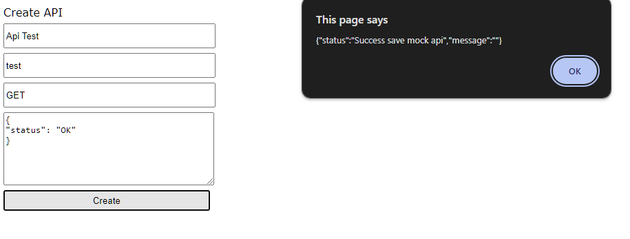
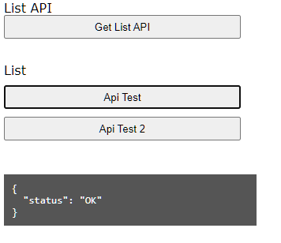

## Runing Backend Service
before runing please run this command
```bash
go mod tidy
```

then
```bash
go run main.go
```

## Open index html
to try this app, open `~/jojonomic-test/index.html`

## Example
### Create mock api


### Get list and response
Click `Get List API` button > click one of button from list > then show the response


